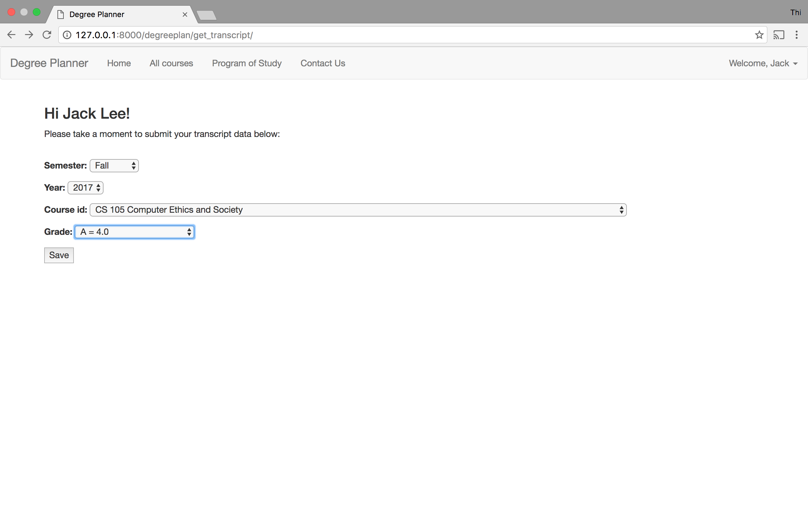
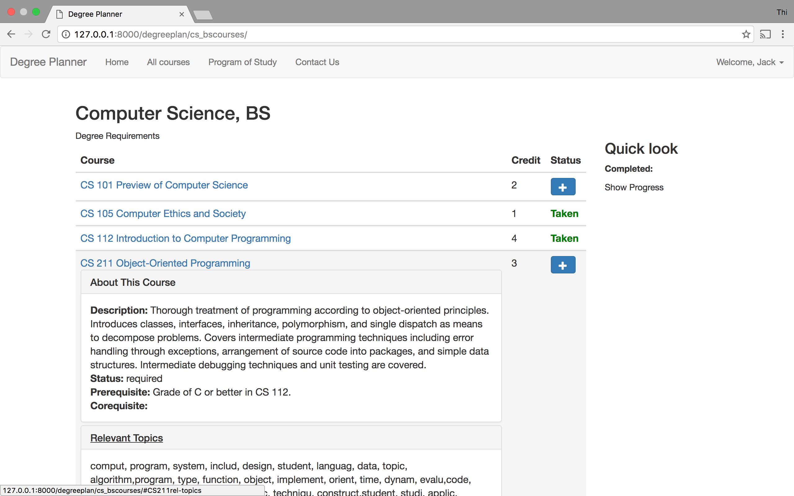
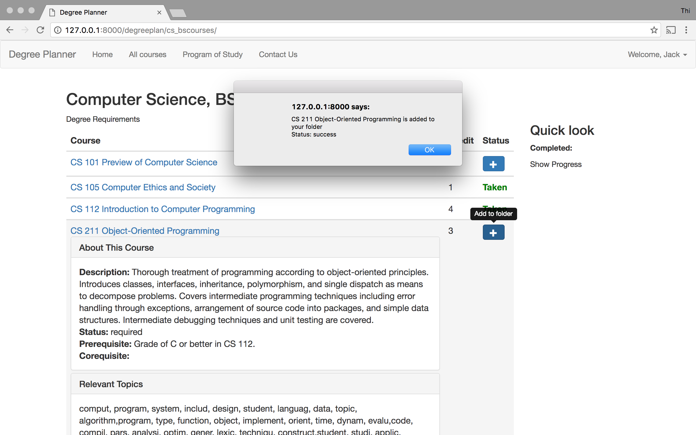
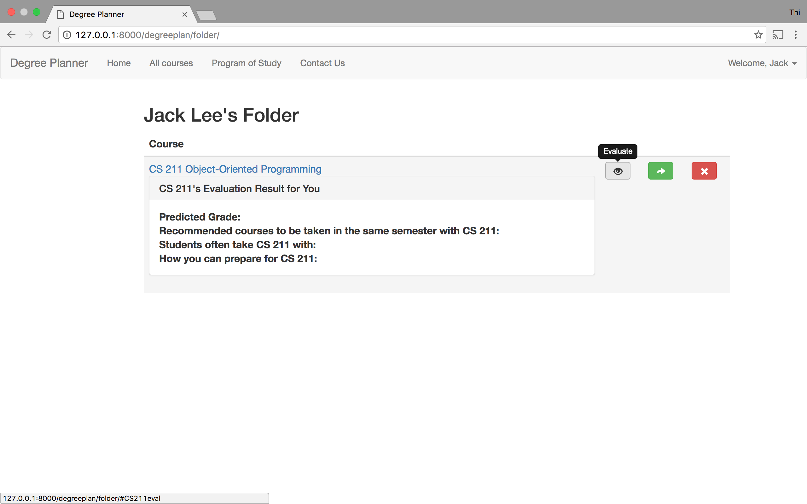
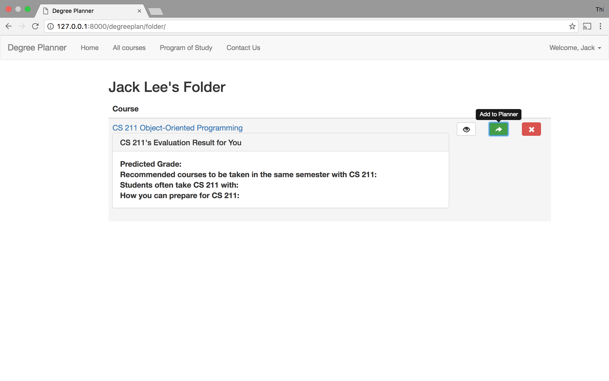

# DegreePlannerWebApp

This Web App is an in-process project. It was developed as part of an NSF funded Research Project:
BIGDATA: IA: DKA: Collaborative Research: Learning Data Analytics: Providing Actionable Insights to Increase College Student Success,
Link: https://nsf.gov/awardsearch/showAward?AWD_ID=1447489&HistoricalAwards=false

All data i.e. all courses (scraped from George Mason University Catalog http://catalog.gmu.edu/index.php ) and Computer Science courses' related topics used in this app are provided by other researchers.

This app currently allows:
- Student registers/logins.
- Student creates a profile, including: pursued degree (currently supported Computer Science, BS degree), transcript data.
- Student can see the remaining courses he/she needs to take to complete degree.
- Student can add a course to his/her folder to evaluate, e.g. view predicted grade for the course (not yet supported), view related topics to the course.
- After evaluating the course, student can add to his/her planner.
- Student can view his/her degree planner interface.

To run the app in your local machine:
After cloning, in the directory that contains SummerResearch2016-DegreePlannerWebApp:
- Activate virtual environment: 
source SummerResearch2016-DegreePlannerWebApp/bin/activate

- Inside SummerResearch2016-DegreePlannerWebApp/StudentTools, activate the server:  
python manage.py runserver

